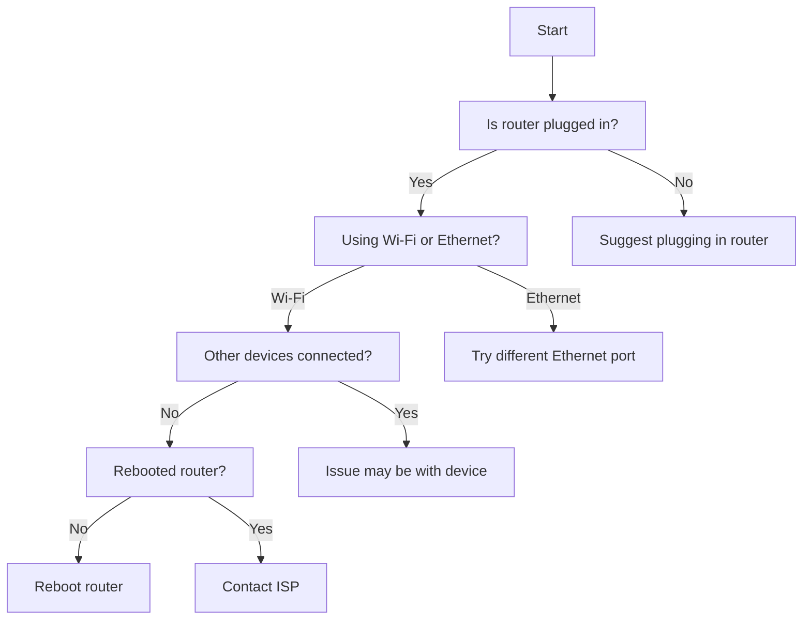

```mermaid
graph TD
    Start[Start]
    Q1[Is router plugged in?]
    Q2[Using Wi-Fi or Ethernet?]
    Q3[Other devices connected?]
    Q4[Rebooted router?]
    End1[Suggest plugging in router]
    End2[Try different Ethernet port]
    End3[Issue may be with device]
    End4[Reboot router]
    End5[Contact ISP]

    Start --> Q1
    Q1 -- No --> End1
    Q1 -- Yes --> Q2
    Q2 -- Ethernet --> End2
    Q2 -- Wi-Fi --> Q3
    Q3 -- Yes --> End3
    Q3 -- No --> Q4
    Q4 -- No --> End4
    Q4 -- Yes --> End5
```