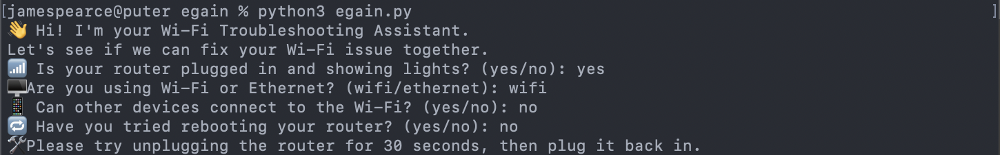
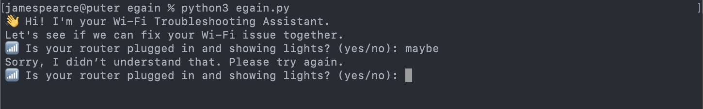

# 💬 Wi-Fi Troubleshooting Chatbot (Python CLI)

A simple command-line chatbot designed to assist users in troubleshooting common Wi-Fi connectivity issues.  
This project was created as part of the eGain SWE Take-Home Assignment for the Customer Service Chatbot Interaction Designer role.

---

## 📦 Features

- Guided conversation flow for diagnosing basic Wi-Fi issues
- User-friendly prompts with built-in error handling
- Modular and well-commented Python code
- Handles unexpected inputs gracefully

---

## 🚀 Setup & Installation

1. **Clone the repository**

```bash
git clone https://github.com/jamespear/egain.git
cd egain
```

2. **Run the chatbot**

Make sure you have Python 3 installed.

```bash
python3 egain.py
```

---

## 🧠 Design Approach

### Scenario: 
> *"My Wi-Fi isn’t working."*

The chatbot guides users through a decision tree:
1. Is the router plugged in?
2. What type of connection is used? (Wi-Fi or Ethernet)
3. Can other devices connect?
4. Has the router been rebooted?
5. If all else fails, suggest contacting ISP.

### Error Handling:
- Re-prompts for unexpected inputs (e.g., "maybe" when "yes/no" is expected)
- Handles casing, spacing, and invalid options

---

## 🖼️ Screenshots
### Possible response using chatbot

### Handling error messages



---

## 📈 Future Improvements

- Add support for voice input/output
- Use NLP to make the bot more conversational
- Add logging for agent handoff or escalation
- Expand scenarios to support more technical issues

---

## 📬 Submission Details

This repository was created for the eGain SWE Take-Home Assignment.  
It demonstrates creativity, user-focused design, and error-resilient interaction in a minimal interface.

Presentation link: https://docs.google.com/presentation/d/1YWUhtzaXqYHe4FJXeLdSIY-G6Qb1gH5Pr6EyFzrKXoA/edit?usp=sharing